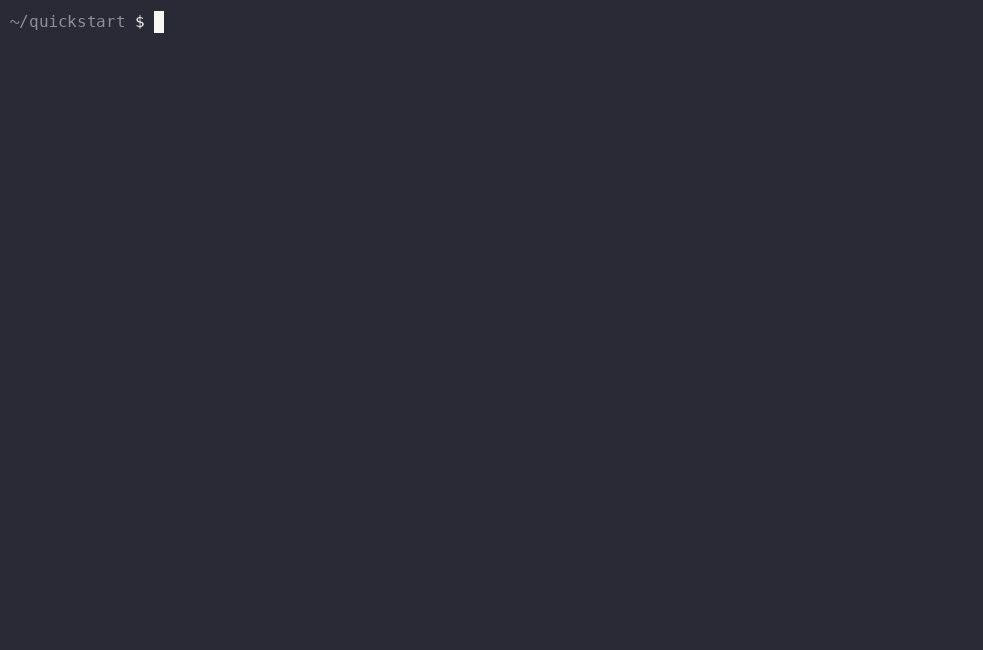

# ACP Starter — LangGraph (Python)

Minimal template for wiring ACP policy & audit into a LangChain 1.x / LangGraph agent.



<sub>A real recording, nothing mocked — captured on the 0.1 decorator flow; the install and the agent run are identical on the 0.2 middleware flow shown below. Re-record with <code>../record-quickstart.sh langgraph</code>.</sub>

## Setup

```bash
cp .env.example .env
# edit .env: set ACP_USER_TOKEN (gsk_...) and OPENAI_API_KEY

bash run.sh
```

`run.sh` creates a local `.venv` via `uv`, installs `langchain` (1.x) + `langgraph` + `acp-langchain` from the monorepo, and runs `starter.py`.

## What to change

- `lookup_record(id)` — replace the body with your real tool logic
- The `@tool` docstring — LangChain uses it to decide when to call the tool
- `agent_name: "my-langgraph-agent"` in `set_context` — rename for dashboard attribution
- `model="openai:gpt-4o-mini"` — swap to any LangChain-supported model string

Add more tools: just decorate more functions with `@tool` and pass them in `create_agent(tools=[...])` — `ACPMiddleware()` already covers them; there is nothing extra to add per tool.

## How the policy layer is wired

`ACPMiddleware()` (from `acp-langchain`) is a LangChain 1.x `AgentMiddleware` registered once via `create_agent(..., middleware=[ACPMiddleware()])`. Its tool-call wrap hook (`wrap_tool_call` / `awrap_tool_call`) surrounds every tool execution:

1. Pre-check → ACP `/govern/tool-use`. **Deny** → the tool function never runs; the middleware returns a synthetic `ToolMessage("tool_error: <reason>")` and the model adapts.
2. Allow → your tool runs.
3. Post-audit → `/govern/tool-output`. **Redact** replaces the output before the model sees it; **block** yields `"[ACP] Blocked: <reason>"`.

LLM calls go direct to your provider with your own key. Policy and audit are tool-layer, not LLM-layer.

Scope it if you need to: `ACPMiddleware(tools=[...])` governs only those names; `ACPMiddleware(exclude=[...])` passes those through.

It composes with LangChain's own middleware — put `HumanInTheLoopMiddleware` in the same list for a human pause on sensitive tools; approved calls still pass through the ACP check on execution.

## Decorator pattern (v0.1-era, still works)

Before LangChain 1.x middleware, the integration stacked a decorator per tool:

```python
from acp_langchain import governed

@tool
@governed("lookup_record")   # policy decorator INSIDE the tool decorator
def lookup_record(id: str) -> str: ...
```

This still works on 1.x, and is the path for legacy stacks (`AgentExecutor`, `create_tool_calling_agent`, `langgraph.prebuilt.create_react_agent` — now in `langchain-classic` / deprecated). Migrating: add `middleware=[ACPMiddleware()]` to `create_agent(...)`, delete every `@governed(...)` line, done. Don't combine both on the same tool, or the call is checked (and audited) twice.

## Migration note (middleware API) — shipped

The middleware migration this README used to describe as future landed: LangChain 1.x's `AgentMiddleware` stack (`wrap_tool_call`, `before_model`, HITL and PII middleware, registered via `create_agent(middleware=[...])`) is stable, and `acp-langchain` 0.2.0 exposes `ACPMiddleware()` on that surface. This starter now uses it as the primary path.

## References

- [`acp-langchain` package source](../../../python/acp-langchain/)
- [LangChain agents docs](https://docs.langchain.com/oss/python/langchain/agents)
- [LangChain middleware docs](https://docs.langchain.com/oss/python/langchain/middleware/custom)
- [LangChain human-in-the-loop docs](https://docs.langchain.com/oss/python/langchain/human-in-the-loop)
- [ACP control model](https://agenticcontrolplane.com/docs/governance-model)

## Get an API key

[cloud.agenticcontrolplane.com](https://cloud.agenticcontrolplane.com/) → create a workspace → Settings → API Keys → New key.
